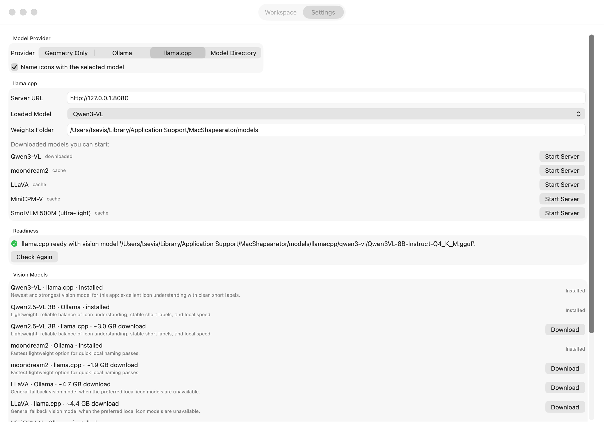

# MacShapearator

A native macOS app for [Shapearator](https://github.com/tsevis/shapearator).

Version `0.4.2`


## The problem this solves

Designers and illustrators rarely draw one icon at a time. You fill a page with
forty sketches, or lay a whole set out on a single artboard, or scan a sheet of
brush marks. The artwork is finished — but it is all in one file, and it is
useless that way.

What you actually need is forty separate assets: each cropped to its own
drawing, sitting on a consistent canvas so they line up in a grid, exported in
whatever formats the project wants, and named something you can find again in
six months. By hand that means selecting, cropping, centring, exporting and
typing a filename forty times over — an afternoon of mechanical work whose only
real skill is patience, and whose results are never quite consistent.

**MacShapearator does that pass for you.** Point it at the sheet; it finds every
individual object, separates it, centres it on a shared canvas, writes each
format you asked for, and records what it did.

The naming tends to be the surprise. Instead of `icon_001.png`, a vision model
running on your own Mac *looks* at each extracted icon and names it for what it
is — `lightbulb.png`, `saxophone.png`, `drumset.png` — with tags and a
confidence score in its metadata. The output stops being a numbered pile and
becomes something you can search.

Everything ships inside the app: the extraction engine, its Python runtime,
Inkscape and potrace are all bundled. There is nothing to install, nothing to
put on your `PATH`, and nothing leaves your Mac — the vision models run locally
and the endpoints are restricted to `localhost`.

*Above: nine instruments extracted from one vector sheet and named by a local
model. The drum kit is drawn as nineteen separate paths and stays a single
icon, because the artwork groups it that way.*

---

## What it does

- Reads `PNG` and `SVG` sheets, exports `PNG`, `JPG`, `TIFF` and `SVG`
- Finds each icon, crops it, and normalizes it onto a shared canvas
- Names icons semantically with a local vision model, via **Ollama or llama.cpp**
- Downloads a vision model for you, from either backend, with progress
- Replaces a previous export cleanly, never touching files you put there
- Writes per-icon metadata that is safe to publish

## Requirements

macOS 13 or newer. Nothing else — the Python engine, its dependencies, Inkscape
and potrace are all bundled.

A vision model backend is optional, and only needed for semantic naming. The
app detects [Ollama](https://ollama.com) and
[llama.cpp](https://github.com/ggml-org/llama.cpp) if you have them, and can
download a model into either.



*Readiness is the engine's own verdict, not a second implementation of it, so
both backends behave identically and every catalog model is one click away.*

---

## Architecture

MacShapearator is a SwiftUI front-end over the Shapearator engine. The engine
stays in Python: it is bundled into the app, pinned to a released version, and
never something a user installs or sees.

```
SwiftUI  ──spawns──▶  Scripts/extract_bridge.py  ──▶  services.extractor
         ──spawns──▶  Scripts/engine_bridge.py   ──▶  services.vision / model_registry
   ▲                                                  services.first_run / llamacpp_*
   └──  PREFLIGHT / PROGRESS / RESULT / MODELS / SETUP / INSTALLED / ERROR  ──┘
```

Both bridges speak one line-based protocol over stdout: `TAG\t{json}`.

Backend readiness, model discovery and model installation are all delegated to
the engine rather than reimplemented in Swift. That is why both model backends
work here, and why engine improvements need no Swift change to arrive.

See [PORTING_PLAN.md](PORTING_PLAN.md) for the roadmap and the reasoning behind
keeping the engine in Python.

---

## Building

```bash
git clone https://github.com/tsevis/shapearator ../shapearator
./build_app.sh
```

Needs [XcodeGen](https://github.com/yonaskolb/XcodeGen), Inkscape and potrace to
assemble the bundle:

```bash
brew install xcodegen potrace inkscape
```

Every external location is discovered automatically and can be overridden:

| Variable | Purpose | Default |
| --- | --- | --- |
| `SHAPEARATOR_SRC` | Shapearator checkout to bundle from | `../shapearator` |
| `SHAPEARATOR_REF` | engine git ref to ship | the newest tested release |
| `PYTHON_SRC` | interpreter root to bundle | a discovered pyenv/framework build |
| `INKSCAPE_APP` | Inkscape to bundle | `/Applications/Inkscape.app` |
| `POTRACE_PREFIX` | potrace install prefix | `brew --prefix potrace` |

Conda prefixes and the Xcode system Python are rejected: neither can be
relocated into an app bundle.

### Running from source

```bash
./run.sh
```

Uses a sibling `../shapearator` checkout, or `SHAPEARATOR_SRC=/path ./run.sh`.

### Tests

```bash
swift test
```

Covers engine-version compatibility, the bridge protocol — including fixtures
captured from real bridge runs, so an engine-side field rename fails a test
rather than arriving as `nil` — and settings migration from older builds.

---

## What gets bundled

The app is ~756 MB:

| | Size |
| --- | --- |
| Inkscape (stripped of tutorials, translations, examples) | 478 MB |
| Python interpreter + the engine's five dependencies | 273 MB |
| App, engine, potrace, assets | ~5 MB |

`build_app.sh` copies the interpreter core *without* its site-packages and
installs only what the engine imports, then verifies those imports before the
build proceeds. Rsyncing a development interpreter wholesale is how an earlier
bundle reached 4.5 GB, carrying TensorFlow, PyTorch and JAX that Shapearator
never touches.

## Engine versioning

The bundled engine is a build artifact, never a checked-in copy. `build_app.sh`
exports it from a git ref and stamps `Resources/BundledBackend/ENGINE_VERSION`.
At launch the app compares that against `AppRuntime.minimumEngineVersion` and
refuses to run against anything older.

That guard exists because it happened: a hand-copied engine sat unnoticed at
version 0.1.0 while the project had moved to 0.4.1. It still imported cleanly,
so the shipped app silently extracted using months-old code. A stale bundle now
fails loudly instead.

To ship a newer engine, tag it in the Shapearator repo and build against it:

```bash
SHAPEARATOR_REF=v0.4.3 ./build_app.sh
```

---

## Distribution

```bash
./release.sh                  # sign, notarize, build a .dmg
SKIP_NOTARIZE=1 ./release.sh  # sign and package only
```

Needs an Apple Developer account. Credentials are never handled by the script:
signing uses a `Developer ID Application` identity already in your keychain,
and notarization a `notarytool` keychain profile you create once.

```bash
xcrun notarytool store-credentials MacShapearator --apple-id you@example.com --team-id TEAMID
```

Publish the disk image as a release asset — never commit it.

---

## Notes

- If you export into Desktop, Documents or Downloads, macOS asks for permission
  the first time. Those folders are privacy-protected; without consent the app
  cannot write there.
- The repository tracks source only. The bundled interpreter, Inkscape, potrace,
  the vendored engine and the `.dmg` are all assembled at build time.

## License

MIT — see [LICENSE](LICENSE). Created by Charis Tsevis.

Components bundled into the packaged app keep their own licenses: Python (PSF),
Inkscape (GPL-2.0-or-later), and potrace (GPL-2.0-or-later). They are shipped
as separate executables the app invokes, not linked into it. If you redistribute
a built `.app`, those terms travel with it.
