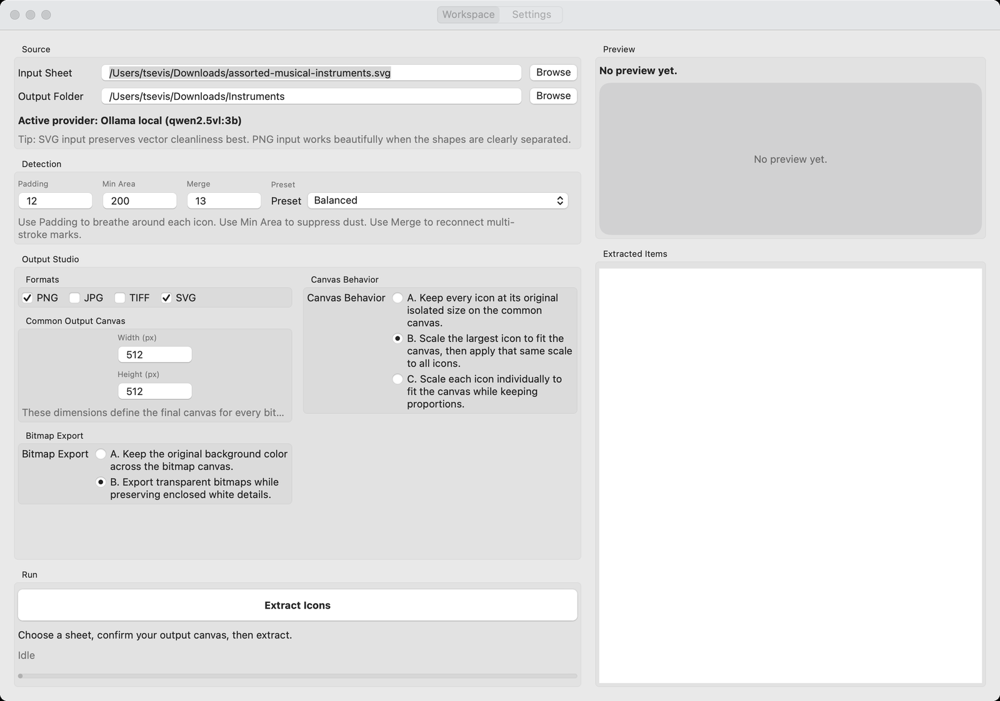

# MacShapearator

A native macOS app for [Shapearator](https://github.com/tsevis/shapearator) —
turn one sheet full of icons into a tidy set of cropped, named, organized files.



Everything ships inside the app. There is no Python to install, no Inkscape to
find, no `PATH` to configure — and nothing leaves your Mac.

---

## What it does

- Reads `PNG` and `SVG` sheets, exports `PNG`, `JPG`, `TIFF` and `SVG`
- Finds each icon, crops it, and normalizes it onto a shared canvas
- Names icons semantically with a local vision model, via **Ollama or llama.cpp**
- Downloads a vision model for you, from either backend, with progress
- Replaces a previous export cleanly, never touching files you put there
- Writes per-icon metadata that is safe to publish

## Requirements

macOS 13 or newer. Nothing else — the Python engine, its dependencies, Inkscape
and potrace are all bundled.

A vision model backend is optional, and only needed for semantic naming. The
app detects [Ollama](https://ollama.com) and
[llama.cpp](https://github.com/ggml-org/llama.cpp) if you have them, and can
download a model into either.

---

## Architecture

MacShapearator is a SwiftUI front-end over the Shapearator engine. The engine
stays in Python: it is bundled into the app, pinned to a released version, and
never something a user installs or sees.

```
SwiftUI  ──spawns──▶  Scripts/extract_bridge.py  ──▶  services.extractor
         ──spawns──▶  Scripts/engine_bridge.py   ──▶  services.vision / model_registry
   ▲                                                  services.first_run / llamacpp_*
   └──  PREFLIGHT / PROGRESS / RESULT / MODELS / SETUP / INSTALLED / ERROR  ──┘
```

Both bridges speak one line-based protocol over stdout: `TAG\t{json}`.

Backend readiness, model discovery and model installation are all delegated to
the engine rather than reimplemented in Swift. That is why both model backends
work here, and why engine improvements need no Swift change to arrive.

See [PORTING_PLAN.md](PORTING_PLAN.md) for the roadmap and the reasoning behind
keeping the engine in Python.

---

## Building

```bash
git clone https://github.com/tsevis/shapearator ../shapearator
./build_app.sh
```

Needs [XcodeGen](https://github.com/yonaskolb/XcodeGen), Inkscape and potrace to
assemble the bundle:

```bash
brew install xcodegen potrace inkscape
```

Every external location is discovered automatically and can be overridden:

| Variable | Purpose | Default |
| --- | --- | --- |
| `SHAPEARATOR_SRC` | Shapearator checkout to bundle from | `../shapearator` |
| `SHAPEARATOR_REF` | engine git ref to ship | the newest tested release |
| `PYTHON_SRC` | interpreter root to bundle | a discovered pyenv/framework build |
| `INKSCAPE_APP` | Inkscape to bundle | `/Applications/Inkscape.app` |
| `POTRACE_PREFIX` | potrace install prefix | `brew --prefix potrace` |

Conda prefixes and the Xcode system Python are rejected: neither can be
relocated into an app bundle.

### Running from source

```bash
./run.sh
```

Uses a sibling `../shapearator` checkout, or `SHAPEARATOR_SRC=/path ./run.sh`.

### Tests

```bash
swift test
```

Covers engine-version compatibility, the bridge protocol — including fixtures
captured from real bridge runs, so an engine-side field rename fails a test
rather than arriving as `nil` — and settings migration from older builds.

---

## What gets bundled

The app is ~756 MB:

| | Size |
| --- | --- |
| Inkscape (stripped of tutorials, translations, examples) | 478 MB |
| Python interpreter + the engine's five dependencies | 273 MB |
| App, engine, potrace, assets | ~5 MB |

`build_app.sh` copies the interpreter core *without* its site-packages and
installs only what the engine imports, then verifies those imports before the
build proceeds. Rsyncing a development interpreter wholesale is how an earlier
bundle reached 4.5 GB, carrying TensorFlow, PyTorch and JAX that Shapearator
never touches.

## Engine versioning

The bundled engine is a build artifact, never a checked-in copy. `build_app.sh`
exports it from a git ref and stamps `Resources/BundledBackend/ENGINE_VERSION`.
At launch the app compares that against `AppRuntime.minimumEngineVersion` and
refuses to run against anything older.

That guard exists because it happened: a hand-copied engine sat unnoticed at
version 0.1.0 while the project had moved to 0.4.1. It still imported cleanly,
so the shipped app silently extracted using months-old code. A stale bundle now
fails loudly instead.

To ship a newer engine, tag it in the Shapearator repo and build against it:

```bash
SHAPEARATOR_REF=v0.4.3 ./build_app.sh
```

---

## Distribution

```bash
./release.sh                  # sign, notarize, build a .dmg
SKIP_NOTARIZE=1 ./release.sh  # sign and package only
```

Needs an Apple Developer account. Credentials are never handled by the script:
signing uses a `Developer ID Application` identity already in your keychain,
and notarization a `notarytool` keychain profile you create once.

```bash
xcrun notarytool store-credentials MacShapearator --apple-id you@example.com --team-id TEAMID
```

Publish the disk image as a release asset — never commit it.

---

## Notes

- If you export into Desktop, Documents or Downloads, macOS asks for permission
  the first time. Those folders are privacy-protected; without consent the app
  cannot write there.
- The repository tracks source only. The bundled interpreter, Inkscape, potrace,
  the vendored engine and the `.dmg` are all assembled at build time.

## License

Shapearator and MacShapearator are by Charis Tsevis. Bundled third-party
components — Python, Inkscape, potrace — keep their own licenses.
