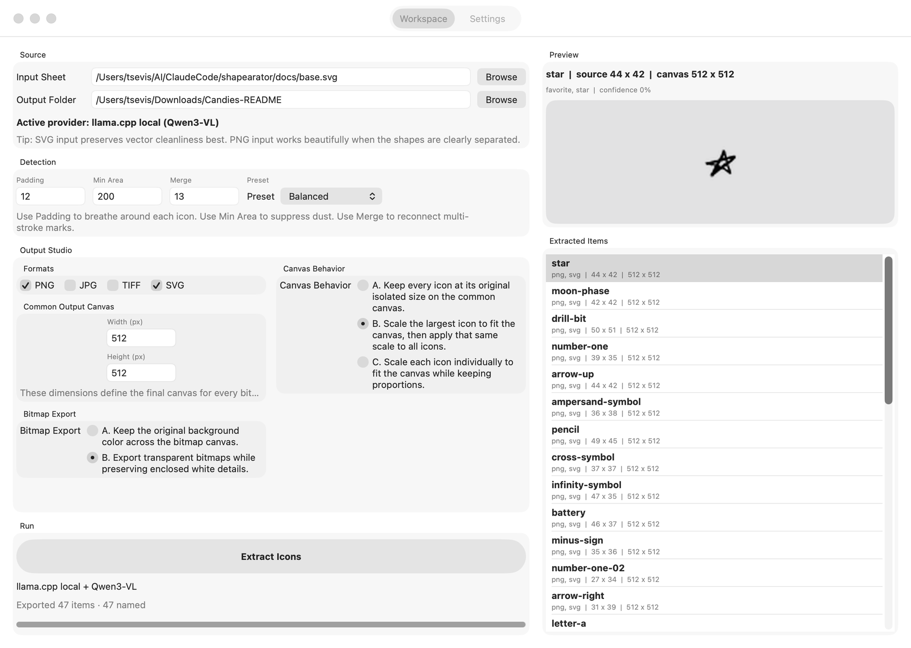
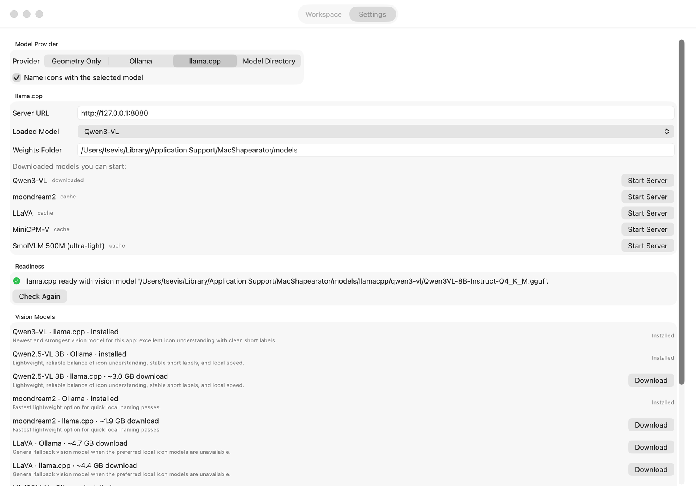

# MacShapearator

A native macOS app for [Shapearator](https://github.com/tsevis/shapearator).

Version `0.4.13`



## The problem this solves

Designers and illustrators rarely draw one icon at a time. You fill a page with
forty sketches, or lay a whole set out on a single artboard, or scan a sheet of
brush marks. The artwork is finished — but it is all in one file, and it is
useless that way.

What you actually need is forty separate assets: each cropped to its own
drawing, sitting on a consistent canvas so they line up in a grid, exported in
whatever formats the project wants, and named something you can find again in
six months. By hand that means selecting, cropping, centring, exporting and
typing a filename forty times over — an afternoon of mechanical work whose only
real skill is patience, and whose results are never quite consistent.

**MacShapearator does that pass for you.** Point it at the sheet; it finds every
individual object, separates it, centres it on a shared canvas, writes each
format you asked for, and records what it did.

The naming tends to be the surprise. Instead of `icon_001.png`, a vision model
running on your own Mac *looks* at each extracted icon and names it for what it
is — `lightbulb.png`, `saxophone.png`, `drumset.png` — with tags and a
confidence score in its metadata. The output stops being a numbered pile and
becomes something you can search.

Everything ships inside the app: the extraction engine, its Python runtime,
Inkscape and potrace are all bundled. There is nothing to install, nothing to
put on your `PATH`, and nothing leaves your Mac — the vision models run locally
and the endpoints are restricted to `localhost`.

*Above: nine instruments extracted from one vector sheet and named by a local
model. The drum kit is drawn as nineteen separate paths and stays a single
icon, because the artwork groups it that way.*

---

## What it does

- Reads `PNG` and `SVG` sheets, exports `PNG`, `JPG`, `TIFF` and `SVG`
- Takes one sheet or a whole folder of them in a single run
- Exports one layered `PSD` per sheet, a layer per shape, pixels or vector shapes
- Finds each icon, crops it, and normalizes it onto a shared canvas
- Splits SVG sheets by the artwork's own groups, by every shape, or by pixels
- Names icons semantically with a local vision model, via **Ollama or llama.cpp**
- Downloads a vision model for you, from either backend, with progress
- Replaces a previous export cleanly, never touching files you put there
- Writes per-icon metadata that is safe to publish

### One sheet, or a folder of them

The **Input** row has two buttons. **Sheet** picks a single file, as before.
**Folder** takes a folder, and every `.png` and `.svg` directly inside it is
extracted in one run — each into its own subfolder of the output folder, named
after the sheet, so two sheets' `icon_001` cannot overwrite each other.

Subfolders are not searched. An export folder sitting inside the input folder
is full of files with the right suffixes, and descending into one would feed a
previous run's icons back through the extractor.

A sheet that cannot be read does not end the run: it is named in the warnings,
its empty output folder is taken back, and the remaining sheets are extracted.
The line under the Input row counts what the app can see before you start,
because choosing the folder *above* the artwork otherwise costs a whole run to
discover.

### One layered Photoshop file

Tick **PSD** among the formats and a sheet becomes one document with a layer
per shape, instead of one file per shape. Two pickers appear, answering
independent questions.

**Layout** decides where a layer sits. *Rebuild the sheet* sizes the document
to the artwork and keeps every shape where it was, so the file opens looking
like the original — the export canvas does not apply, because a canvas that
did would move every shape off the position the layout exists to preserve.
*On the export canvas* places each shape the way its single file is exported,
centred, which stacks them in the middle.

**Layers** decides what a layer is made of. *Bitmap* is plain pixels.
*Bitmap + paths* adds every outline to the Paths panel, so the geometry is
there to select, stroke or convert. *Vector shapes* makes each layer a solid
fill behind a vector mask, which is what Photoshop calls a shape layer.

Two shapes can be reported rather than silently missing: one that covers no
pixel once rasterised gets no layer, and one carrying its own `transform` gets
no outline, because the geometry would land somewhere other than its pixels.

### Splitting an SVG sheet

An SVG sheet can mean two different things, and the difference is invisible to
a pixel. A designer's icon set is `<g>` elements, and the group is the icon —
a drum kit drawn as nineteen paths must stay one icon. A hand-drawn sheet is
loose paths, where one icon is several disconnected strokes that only a raster
pass can gather.

**Auto** reads the artwork and picks: groups if it has them, clustering if it
does not. That is right for both cases above and wrong for a third — a mosaic
or a tessellation, which is loose paths whose tiles *touch*. Clustering dilates
and merges them, and a 417-tile portrait comes out as a single file. `Min Area`
and `Merge` cannot rescue it, because there are no gaps to measure.

**Split**, in the Detection card, settles it:

| Mode | What it does | Use it for |
|---|---|---|
| Auto | Follows the artwork | Icon sets and hand-drawn sheets |
| Every shape | One file per path, polygon or group | Mosaics, tessellations, maps, any contiguous artwork |
| Group by touch | Clusters by pixels, ignoring groups | A grouped file whose groups are wrong |

A run that clustered a whole sheet into one icon says so in the results pane,
so `Auto` getting it wrong looks like a detection result rather than a broken
export.

## Requirements

macOS 15.4 or newer. Nothing else — the Python engine, its dependencies, Inkscape
and potrace are all bundled.

A vision model backend is optional, and only needed for semantic naming. The
app detects [Ollama](https://ollama.com) and
[llama.cpp](https://github.com/ggml-org/llama.cpp) if you have them, and can
download a model into either.



*Readiness is the engine's own verdict, not a second implementation of it, so
both backends behave identically and every catalog model is one click away.*

---

## Architecture

MacShapearator is a SwiftUI front-end over the Shapearator engine. The engine
stays in Python: it is bundled into the app, pinned to a released version, and
never something a user installs or sees.

```
SwiftUI  ──spawns──▶  Scripts/extract_bridge.py  ──▶  services.extractor
         ──spawns──▶  Scripts/engine_bridge.py   ──▶  services.vision / model_registry
   ▲                                                  services.first_run / llamacpp_*
   └──  PREFLIGHT / PROGRESS / RESULT / MODELS / SETUP / INSTALLED / ERROR  ──┘
```

Both bridges speak one line-based protocol over stdout: `TAG\t{json}`.

Backend readiness, model discovery and model installation are all delegated to
the engine rather than reimplemented in Swift. That is why both model backends
work here, and why engine improvements need no Swift change to arrive.

See [PORTING_PLAN.md](PORTING_PLAN.md) for the roadmap and the reasoning behind
keeping the engine in Python.

---

## Building

```bash
git clone https://github.com/tsevis/shapearator ../shapearator
./build_app.sh
```

Needs [XcodeGen](https://github.com/yonaskolb/XcodeGen), Inkscape and potrace to
assemble the bundle:

```bash
brew install xcodegen potrace inkscape
```

Every external location is discovered automatically and can be overridden:

| Variable | Purpose | Default |
| --- | --- | --- |
| `SHAPEARATOR_SRC` | Shapearator checkout to bundle from | `../shapearator` |
| `SHAPEARATOR_REF` | engine git ref to ship | the newest tested release |
| `PYTHON_SRC` | interpreter root to bundle | a discovered pyenv/framework build |
| `INKSCAPE_APP` | Inkscape to bundle | `/Applications/Inkscape.app` |
| `POTRACE_PREFIX` | potrace install prefix | `brew --prefix potrace` |

Conda prefixes and the Xcode system Python are rejected: neither can be
relocated into an app bundle.

### Running from source

```bash
./run.sh
```

Uses a sibling `../shapearator` checkout, or `SHAPEARATOR_SRC=/path ./run.sh`.

### Tests

```bash
swift test
```

Covers engine-version compatibility, the bridge protocol — including fixtures
captured from real bridge runs, so an engine-side field rename fails a test
rather than arriving as `nil` — and settings migration from older builds.

---

## What gets bundled

The app is ~756 MB:

| | Size |
| --- | --- |
| Inkscape (stripped of tutorials, translations, examples) | 478 MB |
| Python interpreter + the engine's five dependencies | 273 MB |
| App, engine, potrace, assets | ~5 MB |

`build_app.sh` copies the interpreter core *without* its site-packages and
installs only what the engine imports, then verifies those imports before the
build proceeds. Rsyncing a development interpreter wholesale is how an earlier
bundle reached 4.5 GB, carrying TensorFlow, PyTorch and JAX that Shapearator
never touches.

## Engine versioning

The bundled engine is a build artifact, never a checked-in copy. `build_app.sh`
exports it from a git ref and stamps `Resources/BundledBackend/ENGINE_VERSION`.
At launch the app compares that against `AppRuntime.minimumEngineVersion` and
refuses to run against anything older.

That guard exists because it happened: a hand-copied engine sat unnoticed at
version 0.1.0 while the project had moved to 0.4.1. It still imported cleanly,
so the shipped app silently extracted using months-old code. A stale bundle now
fails loudly instead.

To ship a newer engine, tag it in the Shapearator repo and build against it:

```bash
SHAPEARATOR_REF=v0.4.3 ./build_app.sh
```

---

## Distribution

```bash
./release.sh                  # sign, notarize, build a .dmg
SKIP_NOTARIZE=1 ./release.sh  # sign and package only
```

Needs an Apple Developer account. Credentials are never handled by the script:
signing uses a `Developer ID Application` identity already in your keychain,
and notarization a `notarytool` keychain profile you create once.

```bash
xcrun notarytool store-credentials MacShapearator --apple-id you@example.com --team-id TEAMID
```

Publish the disk image as a release asset — never commit it.

---

## Notes

- If you export into Desktop, Documents or Downloads, macOS asks for permission
  the first time. Those folders are privacy-protected; without consent the app
  cannot write there.
- The repository tracks source only. The bundled interpreter, Inkscape, potrace,
  the vendored engine and the `.dmg` are all assembled at build time.

## License

MIT — see [LICENSE](LICENSE). Created by Charis Tsevis.

Components bundled into the packaged app keep their own licenses: Python (PSF),
Inkscape (GPL-2.0-or-later), and potrace (GPL-2.0-or-later). They are shipped
as separate executables the app invokes, not linked into it. If you redistribute
a built `.app`, those terms travel with it.

## Model licences

MacShapearator ships no model weights. This repository tracks none, and the
packaged app bundles the interpreter, Inkscape, potrace and the engine, with no
weights (see What gets bundled). The MIT licence in the License section above
covers this repository's own code and does not extend to any model.

Semantic naming is off by default: `Sources/MacShapearator/Models.swift` starts
with `provider = "geometry"` and `semanticNaming = false`. The app does not
download a model when it starts or when icons are extracted. The only action in
the Swift code that asks the engine to download a model is the Download button
in Settings, Vision Models. That panel lists the engine's candidate models and is
shown also while semantic naming is off; after a download the app applies the
provider and model name the engine reports. A model can also be added outside the
app, with Ollama or llama.cpp directly. Weights come from Ollama or from Hugging
Face onto the user's Mac, each under its own terms, which are not the MIT terms of
this app.

This section is information, not legal advice. Terms change, so the current text
at each linked source is the one that counts. The sources were read on
2026-10-09. Where a row says a point is not settled, it could not be settled from
the sources read, and the model's authors are the ones who can settle it.

**What the tables cover.** The model catalogue is not in this repository: the app
asks the Shapearator engine for it (see Architecture). The engine's
[`services/model_catalog.py`](https://github.com/tsevis/shapearator/blob/f8f238cf96319d6b043ca2a0617794b6e8b4f25b/services/model_catalog.py)
lists six vision models, and the first table covers all six as of engine commit
`f8f238c` (2026-09-23), the commit that the default engine reference `v0.4.13` in
`build_app.sh` points to. The captured engine responses `Tests/Fixtures/models.json`
and `Tests/Fixtures/setup_status.json` name the same six vision models and no
other vision model. The second table covers the three further models that
`models.json` lists. In the Swift sources the only model named is the default
Ollama tag `qwen2.5vl:3b` (`ollamaModel` in `Models.swift`); the Swift tests also
name Qwen3-VL.

**What the tables do not cover.**

- Models a user adds. The Ollama model picker lists the vision models found in the
  user's own Ollama, the llama.cpp panel lists the model loaded on the user's
  llama.cpp server, and the Model Library button (shown when Ollama is not
  running) opens `ollama.com/library`. Any other model run this way carries its
  own terms and is in neither table. The Model Directory panel is described in the
  app as a local catalog and says that semantic naming needs Ollama or llama.cpp.
- Other engine versions. A build made with another `SHAPEARATOR_REF` bundles
  another engine version, which can offer other models. Only the catalogue at the
  commit named above was read.
- A test-only name. `Tests/bridge/test_start_server.py` uses the string
  `Qwen/Qwen3-VL-GGUF:Q4_K_M` as a mock value. It is not a repository that the
  engine names, and no such repository could be found on Hugging Face.
- Everything not reviewed for any model: the terms of the datasets a model was
  trained on, base-model licences beyond those named below, the terms of Ollama
  and Hugging Face themselves, and the contents of the weight files (licence
  text was read from cards, licence files and Ollama licence layers).

Vision models the engine catalogue offers:

| Model and weights | Used for | Licence as found | Before commercial use | Sources |
| --- | --- | --- | --- | --- |
| **Qwen2.5-VL 3B**: Ollama `qwen2.5vl:3b`, llama.cpp `ggml-org/Qwen2.5-VL-3B-Instruct-GGUF` (Q4_K_M) | Semantic naming through either backend. It is the default `ollamaModel` in `Models.swift` and the default selection in `setup_status.json` | The sources disagree (note 1): the Qwen Research License Agreement upstream, Apache-2.0 on the Ollama licence layer and on the ggml-org card | Not settled. The upstream licence file grants rights for non-commercial purposes only and says commercial users shall request a licence from Alibaba Cloud (note 1). Ask Alibaba Cloud and check the full text before commercial use | [Upstream licence file](https://huggingface.co/Qwen/Qwen2.5-VL-3B-Instruct/blob/main/LICENSE), [Ollama page](https://ollama.com/library/qwen2.5vl:3b), [ggml-org card](https://huggingface.co/ggml-org/Qwen2.5-VL-3B-Instruct-GGUF) |
| **Qwen3-VL**: llama.cpp only, `Qwen/Qwen3-VL-8B-Instruct-GGUF` (Q4_K_M; about 6.5 GB download according to the app label) | Semantic naming through llama.cpp. It is listed first in `setup_status.json` and has priority 1 in `models.json` | Apache-2.0 in the card metadata of the GGUF repository and of its base model Qwen/Qwen3-VL-8B-Instruct. The base repository has no LICENSE file (HTTP 404), so the card metadata is the only statement found | Check the full Apache-2.0 text before commercial use or redistribution. Training-data terms were not reviewed | [GGUF card](https://huggingface.co/Qwen/Qwen3-VL-8B-Instruct-GGUF), [base model card](https://huggingface.co/Qwen/Qwen3-VL-8B-Instruct) |
| **MiniCPM-V**: Ollama `minicpm-v:latest`, llama.cpp `openbmb/MiniCPM-V-2_6-gguf` (Q4_K_M) | Described in the engine's recommendation text as a second opinion on hand-drawn marks, through either backend. The Ollama page describes MiniCPM-V 2.6, which matches the repository name | Not settled (note 2): an OpenBMB licence (Version 1.0, 5 June 2024) on the Ollama licence layer, Apache-2.0 for the MiniCPM-o/V weights in the OpenBMB README. The upstream Hugging Face card is gated and was not read; the GGUF repository card has no licence field | Not settled. The OpenBMB licence text says commercial use needs an application to OpenBMB for permission plus a registration questionnaire (note 2). Ask OpenBMB and check the full text before commercial use | [Ollama page](https://ollama.com/library/minicpm-v:latest), [OpenBMB README](https://github.com/OpenBMB/MiniCPM-V), [upstream card (gated)](https://huggingface.co/openbmb/MiniCPM-V-2_6), [GGUF repository](https://huggingface.co/openbmb/MiniCPM-V-2_6-gguf) |
| **moondream2**: Ollama `moondream:latest`, llama.cpp `ggml-org/moondream2-20250414-GGUF` | Described in the engine's recommendation text as the fastest lightweight option for quick naming passes, through either backend | Apache-2.0 on the vikhyatk/moondream2 card, on the ggml-org card and on the Ollama licence layer | Check the full Apache-2.0 text before commercial use or redistribution. The Ollama page shows the tag as updated about two years ago, so it may be an older revision than the Hugging Face repository (not verified). Training-data terms were not reviewed | [Upstream card](https://huggingface.co/vikhyatk/moondream2), [ggml-org card](https://huggingface.co/ggml-org/moondream2-20250414-GGUF), [Ollama page](https://ollama.com/library/moondream:latest) |
| **LLaVA**: Ollama `llava:7b`, llama.cpp `ggml-org/llava-1.6-mistral-7b-gguf` (Q4_K_M), a repository that could not be found on Hugging Face (note 3) | Described in the engine's recommendation text as a general fallback, through either backend | Not settled for the Ollama tag (note 3): Apache-2.0 for the Mistral 7B variant, the Llama 2 Community License for the Vicuna variant. No licence could be read for the llama.cpp repository | Not settled; it depends on the base model of the weights actually used (note 3). Check the full texts, and the dataset notices in the LLaVA README, before commercial use | [Ollama page](https://ollama.com/library/llava:7b), [Mistral variant card](https://huggingface.co/liuhaotian/llava-v1.6-mistral-7b), [Vicuna variant card](https://huggingface.co/liuhaotian/llava-v1.6-vicuna-7b), [LLaVA README](https://github.com/haotian-liu/LLaVA) |
| **SmolVLM 500M**: llama.cpp only, `ggml-org/SmolVLM-500M-Instruct-GGUF` (Q8_0) | Described in the engine's recommendation text as a tiny model for constrained machines or a quick smoke test | Apache-2.0 on the ggml-org card and on HuggingFaceTB/SmolVLM-500M-Instruct | Check the full Apache-2.0 text before commercial use or redistribution. The licences of the base models the card names (SmolLM2-360M-Instruct, siglip-base-patch16-512) and the training-data terms were not reviewed | [ggml-org card](https://huggingface.co/ggml-org/SmolVLM-500M-Instruct-GGUF), [upstream card](https://huggingface.co/HuggingFaceTB/SmolVLM-500M-Instruct) |

Further models named in `Tests/Fixtures/models.json`. The fixture lists these
three Ollama models as local (`supportsVision` false, and described as not among
the app's primary recommendations). The engine catalogue does not offer them.

| Model | Licence as found | Sources |
| --- | --- | --- |
| `bge-m3:latest` | MIT: the Ollama licence layer is the MIT text, and the BAAI/bge-m3 card metadata says mit. Check the full text before commercial use or redistribution | [Ollama page](https://ollama.com/library/bge-m3), [BAAI card](https://huggingface.co/BAAI/bge-m3) |
| `gemma4:e4b` | Apache License 2.0 text on the Ollama licence layer. The Google card google/gemma-4-E4B-it declares apache-2.0 and links Google's Gemma 4 licence page. That the Ollama weights are the same as that repository was not verified. Check the full text before commercial use or redistribution | [Ollama page](https://ollama.com/library/gemma4:e4b), [Google card](https://huggingface.co/google/gemma-4-E4B-it), [Gemma 4 licence page](https://ai.google.dev/gemma/docs/gemma_4_license) |
| `ilsp/llama-krikri-8b-instruct:latest` | The Ollama manifest has no licence layer and the page shows no licence text. The Hugging Face card ilsp/Llama-Krikri-8B-Instruct declares license: llama3.1, the identifier Hugging Face uses for the Llama 3.1 Community License. That the Ollama upload is the same as that repository was not verified. Check the full text before commercial use or redistribution | [Ollama page](https://ollama.com/ilsp/llama-krikri-8b-instruct), [Hugging Face card](https://huggingface.co/ilsp/Llama-Krikri-8B-Instruct), [Llama 3.1 licence text](https://github.com/meta-llama/llama-models/blob/main/models/llama3_1/LICENSE) |

1. **Qwen2.5-VL 3B.** The upstream repository declares the Qwen Research License
   Agreement. Its licence file defines Non-Commercial as for research or
   evaluation purposes only (clause 1.i), grants the licence for non-commercial
   purposes only (clause 2.a) and says that anyone commercially using the
   Materials shall request a licence from Alibaba Cloud (clause 2.b). The
   licence layer of the Ollama tag is instead the Apache License 2.0 text, and
   the ggml-org GGUF card declares apache-2.0 while naming the upstream model as
   its base. This README does not settle the disagreement. The upstream text is
   the stricter one and the one to read first; Alibaba Cloud can say which terms
   apply to a given download.
2. **MiniCPM-V.** The licence layer of the Ollama tag `minicpm-v:latest` is an
   OpenBMB licence, Version 1.0 of 5 June 2024. Its preamble says the weights are
   open for academic research and that commercial use is allowed after filling
   out a registration questionnaire. Its section 3 (Additional Commercial Terms)
   says that a deployment on no more than 5,000 edge-side units, or an
   application with fewer than 1 million daily active users, can apply to OpenBMB
   for permission and, after the questionnaire, may be allowed to use the model
   commercially for free; otherwise it says to email OpenBMB to apply for
   authorization, which OpenBMB may grant at its discretion. The OpenBMB
   MiniCPM-V README, in contrast, says the MiniCPM-o/V model weights and code are
   open-sourced under Apache-2.0 and asks users to fill in a registration
   questionnaire optionally. The upstream Hugging Face repository
   `openbmb/MiniCPM-V-2_6` is gated, so its card could not be read, and the card
   of the GGUF repository has no licence field. It is not clear which text
   governs the weights a given download delivers.
3. **LLaVA.** The Ollama page for `llava:7b` describes a vision encoder combined
   with Vicuna and its licence layer is Apache License 2.0 text, but the page does
   not name the exact base model. Its metadata (7.24B parameters, an `[INST]`
   prompt template) resembles the Mistral 7B variant, which suggests but does not
   prove that variant. The LLaVA 1.6 weights differ by base model:
   `liuhaotian/llava-v1.6-mistral-7b` declares apache-2.0 and points to the
   Mistral-7B-Instruct-v0.2 licence, while the card of
   `liuhaotian/llava-v1.6-vicuna-7b` points to the Llama 2 Community License. The
   LLaVA README adds that checkpoints are also subject to the licences of their
   datasets, naming the OpenAI Terms of Use, and of their base models. For
   llama.cpp the engine names `ggml-org/llava-1.6-mistral-7b-gguf`. On 2026-10-09
   Hugging Face answered HTTP 401 for that name without a login, but it gave the
   same answer for a made-up repository name, and a search of the ggml-org
   models for llava returned no result. That repository could therefore not be
   found and may not exist under that name; its licence could not be read, and
   whether the llama.cpp download of LLaVA works was not verified.
